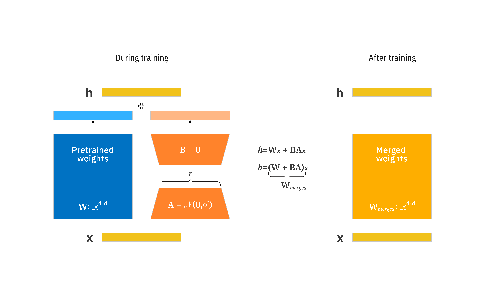

## Parameter Effiecent Fine-tuning using Low Rank Adaptation (LoRA)

This repo performs a simple peft process on a base llm. The following environment variables should be set in a `.env` file in the root of the project.

- MODEL_ID=_Base model from huggingface, I used `HuggingFaceTB/SmolLM2-1.7B` for testing_
- DATASET_ID=_Name of the dataset with instruction and response pairs. `yahma/alpaca-cleaned` is a good starting point._
- OUTPUT_DIR=_Location of the saved fine-tuned model_

---

The training script relies on Supervised fine tuning (SFT) using the `trl` python library.

